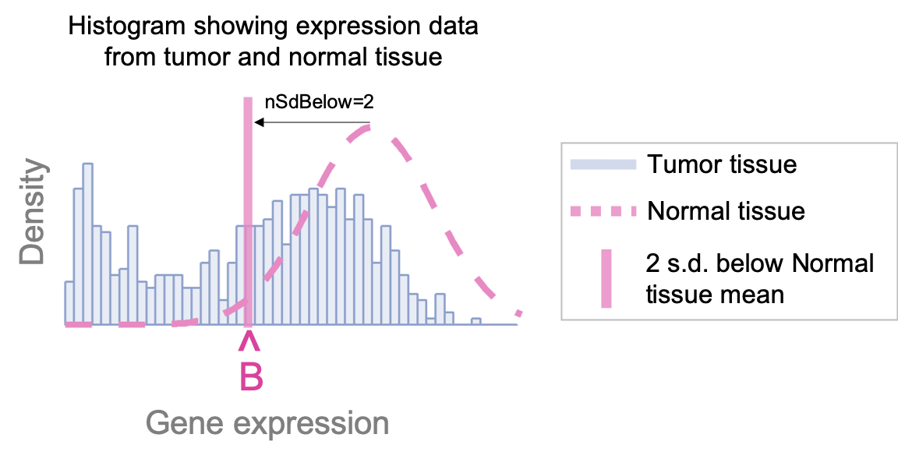
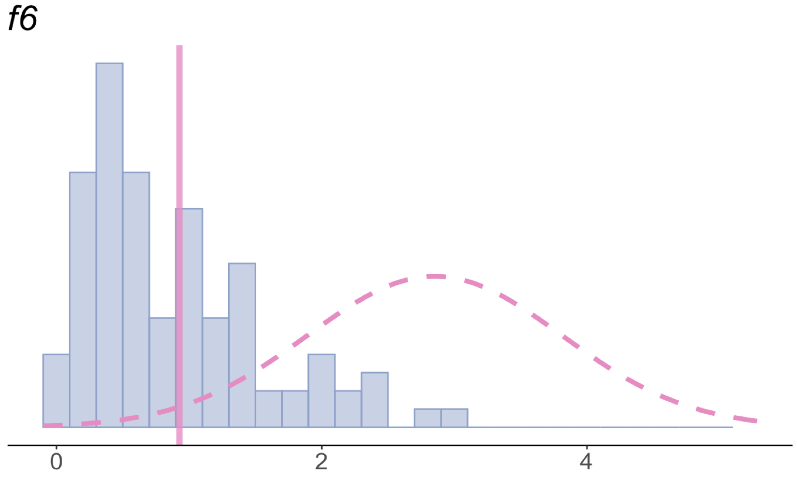

```{r setup, include=FALSE}
knitr::opts_chunk$set(
    collapse=TRUE,
    comment="#>",
    warning=FALSE,
    message=FALSE
)
```


`receptLoss` is an R package designed to identify 
novel nuclear hormone receptors (NHRs) whose expression levels
in cancers could serve as biomarkers for patient survival. 

By utilizing both expression data from both tumor and normal tissue,
`receptLoss` provides biological context to the process of 
tumor subclassification that is lacking in existing methods 
that rely solely on expression patterns in tumor tissue.

`receptLoss` is complementary to 
[`oncomix`](https://bioconductor.org/packages/release/bioc/html/oncomix.html). 
Whereas `oncomix` detects genes that **gain** expression in 
subsets of tumors relative to normal tissue, 
`receptLoss` detects genes that **lose** expression in 
subsets of tumors relative to normal tissue.

## Installation

```{r eval=FALSE}
## Install the development version from GitHub
devtools::install_github("dpique/receptLoss", 
                            build_opts=c("--no-resave-data", "--no-manual"),
                            build_vignettes=TRUE)
```

## Usage

`receptLoss` consists of 2 main functions:

- `receptLoss()` takes in 2 matrices of gene expression data, one from 
tumor and one from adjacent normal tissue. The output is a matrix with 
rows representing genes and columns representing summary statistics. 

- `plotReceptLoss()` generates a histogram visualization of the
distribution of the gene desired by the user.

We begin by simulating two gene expression data matrices, one from tumor 
and the other from normal tissue.

```{r warning=FALSE, message=FALSE}
library(receptLoss)
library(dplyr)
library(ggplot2)

set.seed(100)

## Simulate matrix of expression values from
## 10 genes measured in both normal tissue and 
## tumor tissue in 100 patients

exprMatrNml <- matrix(abs(rnorm(100, mean=2.5)), nrow=10) 
exprMatrTum <- matrix(abs(rnorm(1000)), nrow=10)
geneNames <- paste0(letters[seq_len(nrow(exprMatrNml))], 
                seq_len(nrow(exprMatrNml)))
rownames(exprMatrNml) <- rownames(exprMatrTum) <- geneNames

```

`exprMatrNml` and `exprMatrTum` are $m \times n$ matrices containing 
gene expression data from normal and tumor tissue, respectively, 
with $m$ genes as rows and $n$ patients as columns. The row names of 
these matrices are the gene names. 

These two matrices should have the same number of rows (ie genes), 
with genes listed in the same order between the two matrices. 
However, they don't have to have the same number of columns (ie patients).

To run `receptLoss()`, we also define 2 parameters:

* `nSdBelow` is an integer value that places a lower boundary 
(i.e. `lowerBound`, shown as the pink 'B' in image below) $n$ 
standard deviations below 
the mean of each gene's expression levels in normal tissue 
(dotted pink curve below). 
The larger `nSdBelow` is, the smaller (i.e. further to the left) 
the `lowerBound` becomes. 

    * We recommend setting `nSdBelow`=2, as 
    ~`r round(pnorm(q=2, mean=0, sd=1), 3) * 100`% of the 
    normal tissue expression data should be greater than the `lowerBound` 
    (assuming the expression data from normal tissue is distributed
    as a Gaussian).

* `minPropPerGroup` - a numeric value between $(0,0.5)$ indicating the 
minimum proportion of tumor samples desired within each of the 
two tumor subgroups defined by the `lowerBound`. Determines the value of 
`meetsMinPropPerGrp` (either TRUE or FALSE) in the output.

    * We recommend setting
    `minPropPerGroup`=0.20. Values close to 0 may result in 
    the inclusion of genes that subdivide tumors into very 
    unequally-sized subgroups.
    Values closer to 0.5 will identify genes that subdivide tumors
    into nearly equal-sized groups and may be unnecessarily restrictive.

    



```{r}
nSdBelow <- 2
minPropPerGroup <- .2
rl <- receptLoss(exprMatrNml, exprMatrTum, nSdBelow, minPropPerGroup)
head(rl)
```

The output of `receptLoss()` is an $m\times7$ matrix, 
with $m$ equaling the number of genes. The 7 columns are as follows:

* `geneNm` - the gene name

* `lowerBound` ($B$) - the value `nSdBelow` the mean of
the normal tissue expression data. Can be expressed as 
$$B=\mu_N - \sigma_N * n_{sdBelow},$$
where $\mu_N$ is the mean of the normal tissue expression data, $\sigma_N$ is
the standard deviation of the normal tissue expression data, and $n_{sdBelow}$
is the value `nSdBelow` set by the user.

* `propTumLessThBound` ($\pi_L$) - the proportion of tumor samples with
expression levels less than `lowerBound`. Can be expressed as: 
$$\pi_L =\frac{1}{N_T}\sum_{j=1}^{N_T} \Bigg\{ 
\begin{array}{ll} 1,~ if~x_{j} <
lowerBound  \\ 
0, ~ otherwise 
\end{array},
$$ where $x_{j}$ is the $j^{th}$ tumor sample and 
$N_T$ is the total number of tumor samples.

* `muAb` ($\mu_A$) - "mu above", the arithmetic mean across 
expression values from tumors greater than
(ie above) the `lowerBound`.

* `muBl`($\mu_B$) - "mu below", the arithmetic mean across 
expression values from tumors less than
(ie below) the `lowerBound`.

* `deltaMu` ($\Delta\mu$) - equal to $\mu_A - \mu_B$. The rows in the 
output matrix are 
sorted in descending order by the `deltaMu` statistic, which indicates the 
degree of separation between the two tumor subgroups. Higher `deltaMu` values
indicate tumor subgroups that are more cleanly separated and more likely to 
constitute a bimodal distribution within the tumor samples.

* `meetsMinPropPerGrp` - a logical indicating whether the proportion
of samples in each group is greater than that set by `minPropPerGroup`.
If $min(\pi_L, 1-\pi_L) >$ `minPropPerGroup`, 
then `meetsMinPropPerGrp` is `TRUE`; otherwise, it is `FALSE`.
Genes for which `meetsMinPropPerGrp` equals `FALSE` can be filtered out - 
they do not have a sufficient
proportion of tumors in each group to permit useful tumor subgrouping.


## Visualization

Let's take the top-ranked gene and plot its distribution.
```{r}
clrs <- c("#E78AC3", "#8DA0CB")

tryCatch({plotReceptLoss(exprMatrNml, exprMatrTum, rl, 
    geneName=as.character(rl[1,1]), clrs=clrs)}, 
    warning=function(){
        
    }, error=function(){
        
    }
)
```

Here's what this graph is showing us: 

* The x-axis represents RNA expression values, with lower values toward 
the left and larger values (i.e. higher expression) toward the right. 
The y-axis represents density. The name of the gene 
("`r as.character(rl[1,1])`") is shown
in the upper left of the plot.

* The dotted curve represents a Gaussian distribution fit to the
expression data from normal tissue,
and the blue histogram represents expression data from tumor tissue.

* The pink vertical line corresponds to the `lowerBound` for the 
expression data from normal tissue.

* Since most normal tissue expresses the RNA above the `lowerBound`, 
any tumors that express the RNA below this value have lost RNA 
expression relative to normal tissue. Thus, the `lowerBound` forms 
a boundary between 2 tumor subgroups that either have or have not
lost RNA expression relative to normal tissue. 

## Nuclear Hormone Receptor (NHR) filtering

The question that inspired this package was whether the loss of 
expression of any of the ~50 NHRs (beyond the well-known estrogen, 
progesterone, and androgen NHRs) in uterine tumors
was associated with differences in patient survival. 
NHRs might not only serve as survival biomarkers but also as 
[drug targets](
https://molecular-cancer.biomedcentral.com/articles/10.1186/s12943-019-0971-9),
as their activity can be modulated by small molecules that resemble 
their hormonal ligands.

To facilitate the application of this question to additional cancer
types, a list of all NHRs is included in this package as the object `nhrs`.

This object facilitates filtering of NHRs from a matrix of gene 
expression data, as it contains several commonly-used gene identifiers 
(e.g. HGNC symbol, HGNC ID, Entrez ID, and Ensembl ID) for the NHRs
that might be found in different RNA expression datasets.

The source code for generating `nhrs` is available in ["data-raw/nhrs.R"](
https://github.com/dpique/receptLoss/blob/master/data-raw/nhrs.R).

```{r}
receptLoss::nhrs
```

## Conclusions

- `receptLoss` identifies genes that subclassify tumors 
based on their RNA expression levels *relative to normal tissue*.
The genes are ranked by their $\Delta\mu$ statistic which reflects
a measure of the cleaness of separation (ie bimodality) 
between the two tumor subgroups.

- `receptLoss` can be expanded for use with a variety of tumors,
genes (e.g. to identify novel candidate tumor suppressors),
biological data (e.g. miRNA, protein expression), and even 
non-biological data types where you have numeric data from two groups 
(one normal group and one abnormal group) and where subgroup 
identification is desired within the abnormal group

- `receptLoss` is particularly useful when there are a large number of
tumor samples (hundreds) relative to normal samples (dozens), as is the 
case in several cancer databases, including the uterine cancer database from
the [Cancer Genome Atlas/Genomic Data Commons](
https://portal.gdc.cancer.gov/projects/TCGA-UCEC). 
By assuming that the normal expression data are distributed as a
single Gaussian, `receptLoss` can subclassify large numbers of 
tumors even in the presence of small numbers of normal tissue samples.

Please contact me at daniel.pique@med.einstein.yu.edu with any 
suggestions, questions, or comments. Thank you!


## Display this vignette

```{r eval=FALSE}
vignette("receptLoss") 
```

## Session Info

```{r}
sessionInfo()
```

